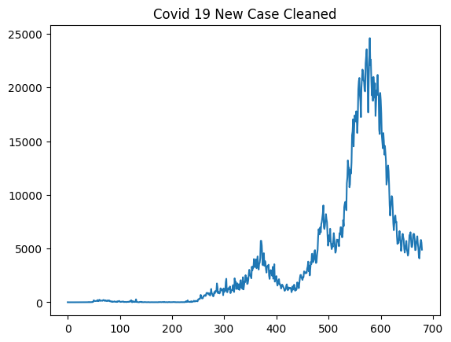
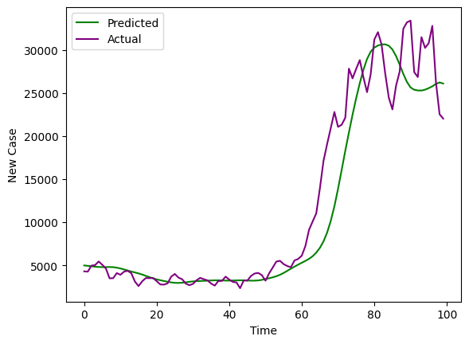
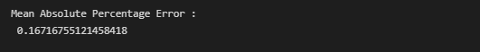
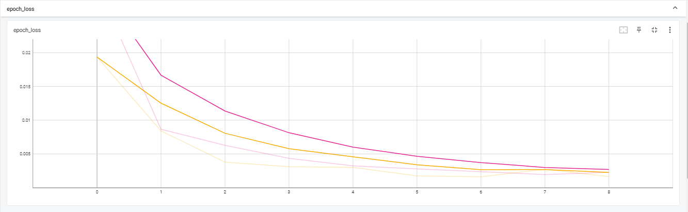

# Predicting the Spread of COVID-19 in Malaysia: A Machine Learning Approach

## Project description

This aim of this project is to predict the TREND of COVID-19 spread in Malaysia
These are steps used to complete this project.

#### 1. Import Necesary Modules

#### 2. Data Loading
    - Loaded csv dataset by using pandas load_csv()
    
#### 3. Data Inspection
    - Inspected the text data for the info, duplicates and missing data. 
    
#### 4. Data Cleaning
    - Filled null values 

    
#### 5. Data Preprocessing
    - Used Min Max Scaler to normalize data
    
#### 6. Model Development
    - Created a model using Tensorflow Long Short-Term Memory (LSTM) with 2 layers and 64 nodes for every layer with Dropout and 25 epochs.
    (*Do increase the nodes, layers and epoch for better results)
    - Used callbacks(ie. TensorBoard and Early Stopping) to prevent overfitting.
    
#### 7. Model Evaluation
    - Evaluated the model by using Mean Absolute Percentage Error (MAPE).
    
#### 8. Save the Model
    -  Saved the model
 
## Results

    - The model are able predict the COVID-19 trend.

 
    - The Mean Absolute Percentage Error (MAPE) is around 0.167%. This model did a great job of predicting COVID-19 spread trend.   

    - Tensorboard graph shows no overfitting or underfitting

## Acknowledgement
The dataset used for this project is by *[The Ministry of Health Malaysia (MOH)](https://github.com/MoH-Malaysia/covid19-public)*
 
